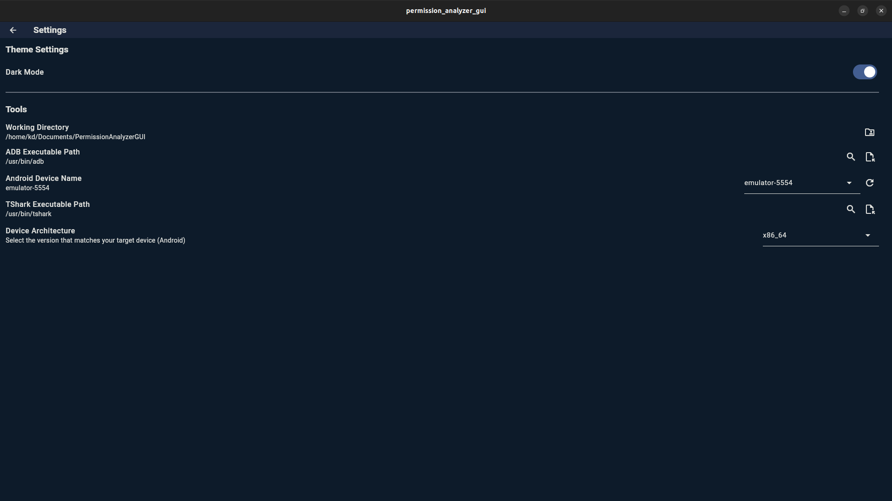
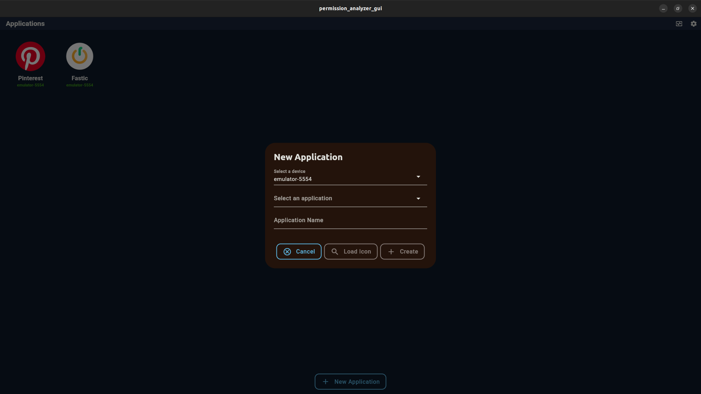
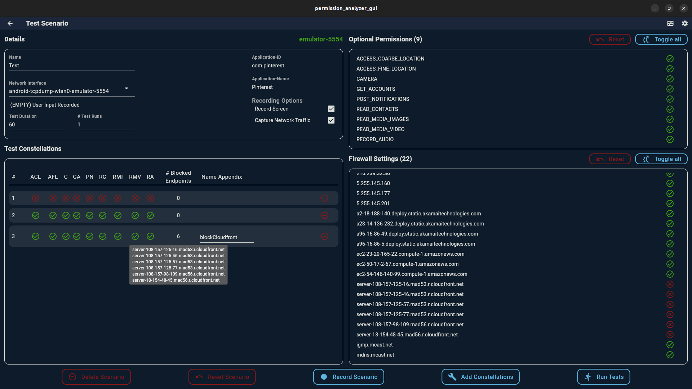
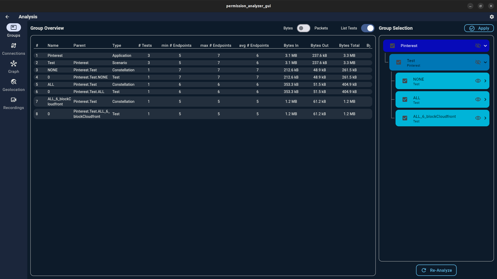
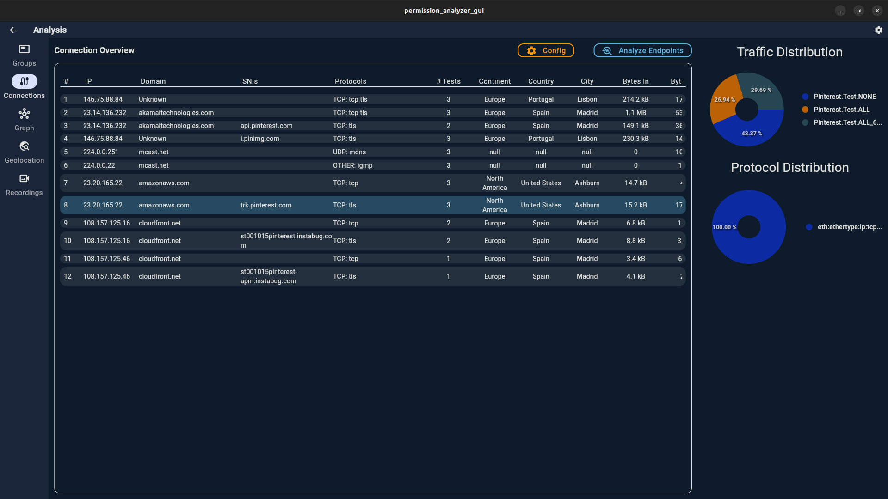
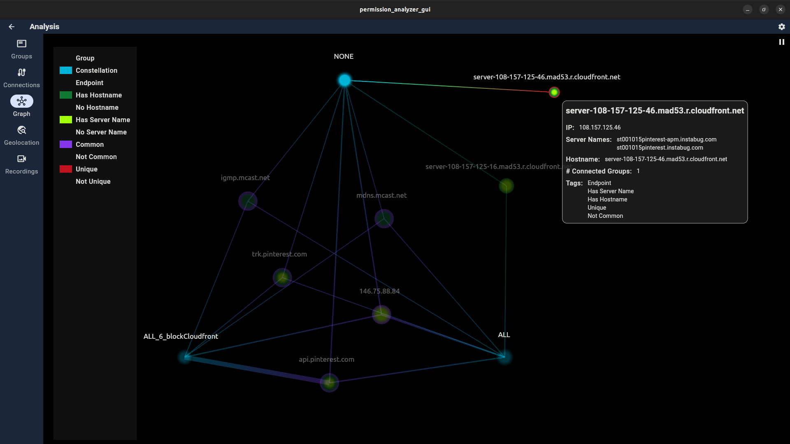
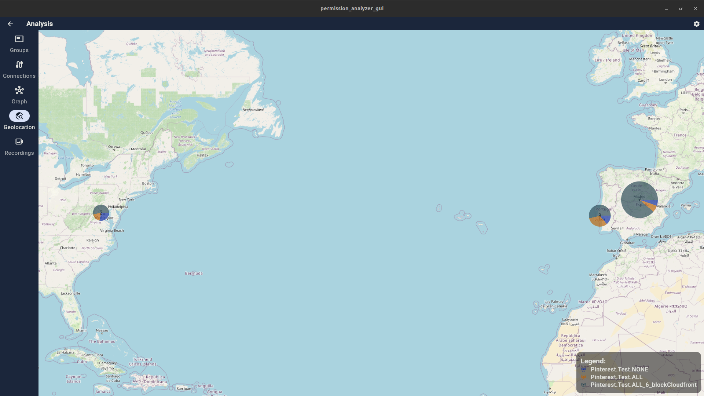
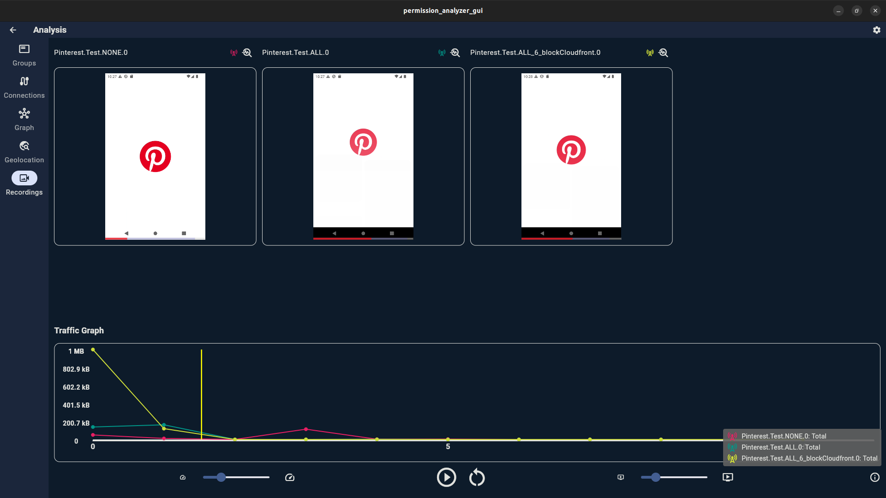

# Android Network Analyzer

## 1) About this Project
This project was created in the context of the 'Traffic Monitoring and Analysis' lecture of the Master in Cybersecurity at UPC Barcelona.

We created a tool to facilitate the process of capturing network traffic from Android applications by
* automating the process of generating comparable network traffic (by recording and replaying user input to the device)
* analyzing the collected data, by
  * grouping the network packets to different connections
  * grouping the connections by domains/server names/ip ranges
  * measuring the traffic volumes on those connections
  * showing the endpoints on a map
  * presenting the traffic volume of the connections in time-sensitive relation to a screen recording of the performed test

## 2) Prerequisites
### 2.1) Rooted Mobile Device
This tool works with Android devices and requires the device to be rooted to function properly.
An easy way to achieve this, is to setup an Android emulator (using a system image without the Google APIs, to enable root access).

### 2.2) Android Debug Bridge
To interact with the Android device, the tool uses the Android Debug Bridge ([adb](https://developer.android.com/tools/adb)).
To test, if the Android device provides root-access, simply run `adb root` from the commandline.

### 2.3) TShark
To capture the network traffic, the tool uses [Tshark](https://tshark.dev/setup/install/), the commandline version of [Wireshark](https://www.wireshark.org/).
When installing Wireshark, it is important to also install the extension [androiddump](https://www.wireshark.org/docs/man-pages/androiddump.html) to be able to capture the traffic from the device.

## 3) Get the Tool
### 3.1) Precompiled
Download the precompiled program from the GitHub-Releases.
Precompiled versions are currently available for Mac and Linux.
Windows should also be supported, but is currently not very well tested, as the main development took place on Linux and most of the tests were performed on Mac.

### 3.2) Compile it yourself
In order to compile the program by yourself, just clone the repository, setup the [Flutter](https://docs.flutter.dev/get-started/install) environment and build the project.

## 4) Use the Tool
In order to use the tool, follow these steps to get started with analysing Android applications:

###  4.1) Setup
1. Connect your Android device to the computer.
2. At the first start, go to the Settings page and set 
   1. the path of the **adb**-executable
   2. the path of the **tshark**-executable
   3. choose the architecture of your mobile device
   4. select the connected Android device (if it is not shown, click the button to rescan for adb-devices)

3. Go back to the main page and create a new application
   1. Select the device you want to use for testing
   2. Select the application you want to test (they are listed by their IDs, so you might have to lookup the ID on the app store or somewhere else)
   3. Enter the name of the application manually
   4. (optional and not important) On Linux/Mac, you can try to extract the app-icon from the application, but it might fail in case the icon has an unexpected filename

### 4.2) Test Scenarios
After selecting the application you want to test, you can create different test-scenarios.
A scenario defines some settings about the tests, including:
* the network interface to capture the traffic
* the duration of each test,
* whether or not to record the screen during each test (in that case, the maximum test duration is 180 seconds)
* whether or not to capture the traffic
* the number of tests to be performed (after running some tests, this number can only be increased to run more tests)
* a record of user input can be created which will then be replayed at every test run ('Record Scenario' button)

#### 4.2.1) Test Constellations
TestConstellations can be created, which contain a set of permissions their state (granted or revoked).
Additionally, IP addresses that were captured with that application in previous tests can be blocked in a constellation to observe how the application reacts to that.
If firewall settings were chosen, a name appendix should be set for the corresponding TestConstellation, to identify it better.
This needs to be done manually, as there is currently no good way to give a name automatically.
(Note: When two TestConstellations have the same name and appendix, there might be problems in the Analysis view)

After configuring a constellation, click the button 'Add Constellations' to save them for the tests.
Permissions can be set to **granted**, **revoked** or **testing**.
When selecting **testing** for a permission, one constellation will be created with the permission granted and one with it being revoked.

### 4.3) Analysis Tabs
Once the tests are completed, you can navigate to the "Analysis" section (located at the top right, next to the settings).
Depending on the page where you go to the Analysis page, will define the scope of data represented there (if you go from applications-view, all data from all applications will be shown; when going from within a scenario, only the data from that scenario will be analyzed).

#### 4.3.1) Group Tab
This tab shows the different 'Test Groups' that can be analyzed.
A Test Group is a set of test runs and is represented in a tree structure.
(Application > Scenario > Constellation > Test Run)

This tab contains a table with relevant information, such as 
* the number of tests performed
* the minimum and maximum number of endpoints that were contacted within the tests
* ...

The selection of groups on this page will influence what content is displayed in the other tabs.
**Tip**: Use the tree view on the right to select the data to analyze (deselecting a group will ignore all traffic within that group) and what data to show (groups to show will be visible in other tabs like the graph view etc.). 
You can also use the "bytes/packets" option to choose the unit to measure the traffic volume (bytes or packets).

#### 4.3.2) Connections Tab
In this table, you will find detailed information about the observed connections, including IP addresses, names, locations, traffic volumes, ...
Click 'Analyze Endpoints' to fetch data like DNS, Geolocation and WhoIs records.
(Tip: this will only query the endpoints that have not been analyzed. Right-click, to force analyzing ALL endpoints)
By right-clicking an entry of the table, you can show the whois record and copy a filter to use in Wireshark to show only the packets corresponding to that connection.

Use the 'Config' view to customize the table and also group the connections.
Grouping connections will combine all connections with the same server name (SNI), domain or IP range x.y.z.0/24.
This will also affect the representations on the other tabs (Graph and Geolocation).

#### 4.3.3) Graph Tab
This section shows the relationship between selected test groups.
It should make it easier to identify common/unique endpoints.

**Note**: Hovering over the endpoints or connection lines will provide additional details.
**Note**: Clicking on tags in the legend allows to show/hide the corresponding nodes in the graph.

#### 4.3.4) Geolocation Tab
This tab displays the geographical locations of the saved endpoints on a world map. 
You can zoom in for more details.
The size of the markers represent the traffic volume that goes to that location.
The colors represent that share of the traffic volume for each test group.

#### 4.3.5) Recordings Tab
If you enabled screen recording while setting up the tests, the recordings will appear here.

For each recording, the traffic timelines for individual connections (or a summary of all connections with the timeline 'Total') can be selected to be displayed in the 'Traffic Volume' chart.

**Note**: The best way to understand the tool is to just play around with it :)

## Credits
Thanks to [Cartucho](https://github.com/Cartucho) for the nice [repository](https://github.com/Cartucho/android-touch-record-replay) to record and replay touchscreen events, which was the foundation for our record and replay feature (with some changes, but still very valuable resource!)